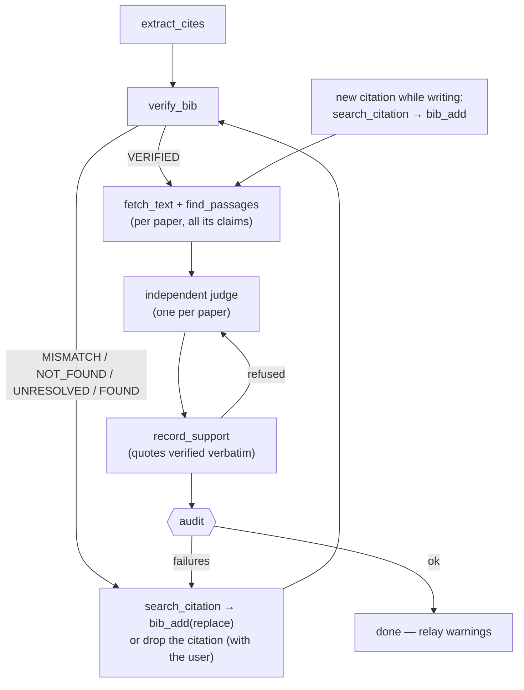

# Cite-Check: real papers, official BibTeX, supported claims

## Overview

An LLM-drafted bibliography fails in three ways, and this skill checks all
three with code rather than with confidence:

1. **Existence** — the paper must exist, and the identifier in the `.bib`
   must resolve to *that* paper. A real DOI attached to an invented title is
   the commonest fabrication and counts as one.
2. **Provenance** — BibTeX entries are fetched from the registry that owns
   the record (ADS, Crossref, DataCite, INSPIRE, arXiv) and stamped with a
   provenance comment. Nobody, human or model, types a `.bib` entry.
3. **Support** — for every citation instance, an independent judge reads
   the cited paper's text and returns a verdict backed by quotes that the
   tool checks are verbatim. A real paper cited for something it does not
   say is a fabrication too.

The enforcement lives in an MCP toolbox (`mcp/server.py`). Registry
lookups, title/author/year comparison, official export, quote verification
and the audit gate are computed there and returned as tool results; the
agent's job is to call them and act on what comes back.

This skill is **harness-agnostic**: it needs `<run-shell>` with Python 3.10+
and network access, file read/write, and — for the support check —
`<spawn-subagent>` or a disciplined second pass.

---

## Harness Adapter

| Capability | Claude Code | OpenAI Codex CLI | Google Antigravity | Fallback |
|---|---|---|---|---|
| toolbox tools | `mcp__cite-check__*` | server `cite_check` | server `cite-check` | CLI mode (below) |
| `<spawn-subagent>` (the judge) | `Agent`, `subagent_type: general-purpose` | *(none — Fallback)* | spawn `TypeName: self` | judge in a separate later pass, passages in front of you |
| `<run-shell>` | `Bash` | `shell` | terminal tool | — (required) |
| `<read-file>` / `<write-file>` | `Read` / `Write` / `Edit` | `apply_patch` / shell | file tools | — (required) |

**Bootstrap (once per session, before the first citation task):**

1. Look for the tools in your tool list. Present → use them.
2. Absent → run `bash <skill-dir>/mcp/setup_mcp.sh` via `<run-shell>`
   (idempotent: builds `mcp/.venv`, smoke-tests, registers the server in
   every harness found; tools appear at the **next** session start).
3. This session → CLI mode, same code:
   `<skill-dir>/mcp/.venv/bin/python <skill-dir>/mcp/server.py call <tool> '<json-args>'`
   (exit 0 = pass; 1 = fail/blocked; JSON verdict on stdout).
4. Call `ping`. No ADS token → say so once to the user (astronomy search
   and ADS exports are off; Crossref/arXiv/OpenAlex/INSPIRE still work): the
   installer asks for it, and `bash <skill-dir>/mcp/setup_mcp.sh --keys`
   asks again from a terminal, storing it in the OS keychain or a 0600 file
   (`references/registries.md` § Configuration). Never ask the user to
   paste a token into the chat, a config file, or a command line.

Never edit anything under `mcp/` during a task.

---

## Tools

| Tool | Does | Trust it for |
|---|---|---|
| `search_citation(title, author, year, hint, context, query)` | multi-registry search, duplicates merged, **ranked by cite-check's own scoring** (registry ranking is measurably wrong) | finding the real id of a paper you can describe; a `confidence: high` candidate |
| `resolve_citation(identifier \| [ids])` | arXiv / DOI / bibcode / OpenAlex / INSPIRE → metadata + cross-linked ids; batched | existence of an id; nothing more |
| `fetch_bibtex(identifier, key, prefer, journal_format, tex_path)` | official BibTeX from ADS → Crossref → DataCite → INSPIRE → arXiv (first that has it), key rewritten, encoding-only cleanup | the only source of `.bib` text |
| `bib_add(bib_path, items, replace, tex_path)` | fetch + insert with `@comment{cite-check: …}` provenance; detects duplicates and key conflicts; `replace=true` swaps a hand-written entry for the official one | writing the `.bib` |
| `verify_bib(bib_path, keys, tex_path)` | per entry: resolve its own ids, compare title / first author / year; entries without ids are searched | VERIFIED · FOUND · PROBABLE · MISMATCH · NOT_FOUND · UNRESOLVED |
| `extract_cites(tex_path)` | every `\cite*`/biblatex instance across `\input`, with the claim sentence (`⟨cite:key⟩` marks the spot), context, file:line, keys, `.bib` files | the units the support check works on |
| `fetch_text(identifier, pdf_path)` | the paper's text: arXiv HTML → arXiv PDF → open-access PDF → abstract; cached globally; `pdf_path=` for your own copy of a paywalled paper | `basis`: fulltext / abstract / none |
| `find_passages(identifier, [claims])` | abstract + top passages per claim by content-word overlap | what the judge reads first |
| `record_support(workdir, key, claim, verdict, identifier, quotes, note, judge)` | stores a verdict **only** with verbatim quotes (SUPPORTS/PARTIAL/CONTRADICTS) or a note (UNSUPPORTED/UNVERIFIABLE); refuses UNVERIFIABLE when full text exists | the ledger cannot be narrated into a pass |
| `ledger_read(workdir)` | the manuscript's verdicts | resuming |
| `audit(tex_path, bib_path, require_support)` | the gate: undefined keys, existence failures, missing / stale / negative verdicts; writes `.cite-check/audit.md` | `ok: true` = done |

Full argument lists are in each tool's docstring (`server.py call <tool>`
with bad args prints it). Registry behaviour and thresholds:
`references/registries.md`.

---

## Workflows

Pick the one that matches the request; all three end in `audit`.

### A. Add a citation while writing

1. `search_citation` with what you know — best is `title`; else
   `hint="Smith2019"` plus the sentence as `context`; a pasted DOI/arXiv id
   is resolved directly. Read the candidates: take a `high`; ask the user
   about a `medium` (show title, year, venue, id); never take a `low`.
2. `bib_add(bib_path, items=[{"identifier": <id>, "key": <key>}], tex_path=…)`.
   `duplicate` → cite `existing_key`. `no-official-bibtex` → do not cite it;
   tell the user.
3. Write the sentence with `\cite{<key>}` (natbib/biblatex variant as the
   document uses).
4. Support-check that instance (Workflow C) before the passage is called
   done. Batch when several citations were added.

### B. Verify an existing manuscript

1. `extract_cites(main.tex)` → keys, instances, `.bib` files.
2. `verify_bib(bib, keys=<cited keys>, tex_path=main.tex)`. Fix before
   going on: MISMATCH / NOT_FOUND / UNRESOLVED entries are either
   fabrications (tell the user; remove or replace the citation) or entries
   whose real paper `search_citation` can find (then
   `bib_add(…, replace=true)`). FOUND entries (no identifier in the entry)
   get replaced with the official one the same way.
3. Support pass (Workflow C) over every instance without a ledger verdict.
4. `audit(main.tex)`. Relay `failures` and `warnings` to the user verbatim
   from the report; do not soften them.

### C. Support check (the judge)

Protocol and judge prompt: `references/support.md`. In short:

1. Group instances `by_key`. For each cited paper: `fetch_text(id)`
   (`pdf_path=` for paywalled ones the user has), then
   `find_passages(id, [every claim citing it])`.
2. Spawn **one independent judge per paper** with the title, abstract,
   passages and the claims — never the manuscript's argument. Without
   `<spawn-subagent>`, judge in a separate pass after all writing is done,
   passages in front of you, and record `judge: "inline"`.
3. `record_support` per instance with the judge's verdict, verbatim quotes
   and note. A refusal (quote not found, note missing) goes back to the
   judge with the tool's reason; the writer does not "fix" the quote.
4. Verdicts: SUPPORTS · PARTIAL · UNSUPPORTED · CONTRADICTS · UNVERIFIABLE.
   UNSUPPORTED and CONTRADICTS fail the audit; the fix is a different paper,
   a weaker sentence, or no citation — decided with the user.

### Called by another skill

co-writer and co-scientist delegate all citation work here; the contract
(what they call, what `ok` means, what they must not do) is
`references/integration.md`.

---

## Hard Gates

<HARD-GATE>
A BibTeX entry enters a `.bib` only through `bib_add` (or `fetch_bibtex`
pasted unchanged except for its key). Never compose, complete, "fix up" or
paraphrase an entry — not the title, not the authors, not the year, not the
DOI. If no registry exports one, the work is not cited from this tool; say
so.
</HARD-GATE>

<HARD-GATE>
An identifier that did not come from `search_citation` / `resolve_citation`
in this session is not cited. Model memory of a DOI, arXiv id or bibcode is
a search query, not a citation.
</HARD-GATE>

<HARD-GATE>
A manuscript is not reported as citation-clean until `audit` returns
`ok: true` with `require_support: true`. Verdicts come from the judge via
`record_support`; the writer never records its own.
</HARD-GATE>

---

## Anti-Patterns (each one was measured, see `references/registries.md`)

- **"The API returned something."** Crossref returns 177 000 hits for a
  nonsense title; ADS `link_gateway/…/ABSTRACT` 302-redirects for a
  fabricated bibcode. Existence means title similarity ≥ 0.9 against the
  record the entry's own identifier resolves to. `verify_bib` does this;
  a bare `resolve_citation: true` does not.
- **Trusting the registry's first hit.** Crossref and OpenAlex both rank a
  fraudulent republication of *Attention Is All You Need* above the real
  paper. Read the candidate list, not position one.
- **Checking only entries that have identifiers.** A third of a real
  astronomy `.bib` carries no DOI or arXiv id, and those are the recent,
  highest-risk papers. `verify_bib` searches them; FOUND means "replace
  with the official entry", not "fine".
- **"It compiles."** BibTeX happily builds a PDF with undefined citations
  and fabricated entries. `audit` checks the key sets and the registry, not
  the log.
- **Paraphrased evidence.** A quote the tool cannot find in the paper is
  not evidence. Quote the paper; if it does not say it, the verdict is not
  SUPPORTS.
- **Self-grading.** The agent that chose the citation must not be the one
  that judges whether the paper supports it.
- **Ignoring strength.** "shows" cited to a paper that "suggests" is
  PARTIAL. Judge the sentence as written.
- **Hand-typing months, journals, author lists** to make an export "look
  right". `fetch_bibtex` already normalises encoding; anything else changes
  the record.

---

## Reference Index

Load on demand:

- `references/registries.md` — each registry's coverage, endpoints, auth,
  measured failure modes, matching thresholds, caching, configuration
  (`ADS_API_TOKEN`, `CITE_CHECK_MAILTO`, `CITE_CHECK_CACHE`)
- `references/support.md` — the claim-support protocol: units, verdict
  rubric, quote rules, judge independence, judge prompt template, efficiency
- `references/integration.md` — contract for co-writer / co-scientist and
  any other caller
- `mcp/server.py` — the toolbox; `mcp/setup_mcp.sh` — idempotent
  per-harness registration; `tests/verify_mcp.sh [--network]` — smoke tests
  on a fixture manuscript with one real-DOI-wrong-title entry, one
  identifier-less real paper, and two fabrications

## Process Flow

