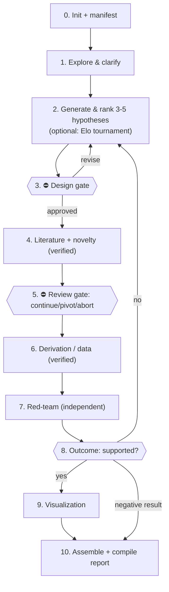

# Co-Scientist: Scientific Research Partner

## Overview

Co-Scientist is an orchestrator that turns a research idea into grounded,
verified, written-up work. It generates and ranks competing hypotheses, grounds
them in verified literature, performs and **independently verifies** rigorous
mathematics, analyzes data reproducibly, **adversarially red-teams** its own
conclusions, and assembles a LaTeX report. Its guiding rule: **verify substance,
do not just perform process.** A well-formatted but wrong derivation, a fabricated
citation, or an unchallenged hypothesis is a failure even if every step was
"followed."

This skill is **harness-agnostic**: it runs on Claude Code, Google Antigravity,
or any agent harness, by mapping its capabilities through the Harness Adapter
below.

---

## Harness Adapter

**FIRST, before anything else**, determine which harness you are running in by
checking which tools you actually have available. Then, for every
`<capability>` token used in this skill and its reference files, use the
matching column. If a row's tool does not exist for you, use the Fallback.

| Capability            | Claude Code                                    | Google Antigravity                      | Fallback (any harness)                 |
|-----------------------|------------------------------------------------|-----------------------------------------|----------------------------------------|
| `<web-search>`        | `WebSearch` tool                               | `search_web`                            | —                                      |
| `<web-fetch>`         | `WebFetch` tool                                | `search_web` on a URL / browser tool    | —                                      |
| `<literature-search>` | `<web-fetch>` arXiv API + OpenAlex API†        | `literature-search-arxiv` / `-openalex` | `<web-search>` + `<web-fetch>`         |
| `<spawn-subagent>`    | `Agent` tool, `subagent_type: general-purpose` | spawn with `TypeName: self` / `research` | do the work inline (no subagent)      |
| `<image-gen>`         | *(none — use Fallback)*                         | `generate_image`                        | matplotlib / TikZ / Mermaid            |
| `<run-shell>`         | `Bash` tool                                    | shell/terminal tool                     | —                                      |
| `<read-file>` / `<write-file>` | `Read` / `Write` / `Edit`             | file read/write tools                   | —                                      |

† arXiv API: `http://export.arxiv.org/api/query?search_query=...`
  OpenAlex API: `https://api.openalex.org/works?search=...`
  Crossref (DOI resolve): `https://api.crossref.org/works/<doi>`

State your detected harness once, at the start of the run, and record it in the
run manifest (see `references/protocols/checkpointing.md`).

---

## When to Use

Use this skill for **multi-step research projects** where the goal is to develop,
ground, verify, and write up an idea:

- Developing a mathematical theory or formal model
- Formulating and testing a research hypothesis (against literature, math, or data)
- Brainstorming and ranking novel research directions
- Producing a written, figure-rich scientific report

## When NOT to Use

Answer these **directly**, without the workflow, modes, scaffolding, or
subagents below:

- One-off factual questions or quick lookups
- A single algebra step, integral, or textbook derivation with one right answer
- Code or debugging help
- Anything the user does not want turned into a multi-phase research artifact

If unsure, ask one scoping question (see Operating Modes) rather than defaulting
to the full pipeline.

---

## Operating Modes

Not every request deserves a full project. Classify the request in your first
turn and pick the lightest mode that fits. **Default to the lightest plausible
mode**; escalate only if the user asks for a report/multi-part project or the
work clearly spans multiple phases.

| Mode | When | What runs |
|------|------|-----------|
| **Quick** | A direct question with a short answer | Answer inline. Show working. No scaffolding. |
| **Derivation** | A single derivation/proof, or a focused analysis | Inline, but follow the Math Derivation Protocol (incl. sanity checks + verification). Optional single checkpoint. No hypothesis gate, no LaTeX unless asked. A "Derivation Plan" (statement, method, assumptions) replaces the hypothesis gate — confirm it in one short message, then proceed. |
| **Full Project** | A genuine multi-phase research effort, or the user asks for a report | The full Workflow below: workspace + manifest, hypothesis ranking, literature, derivation/data, red-team, visualization, LaTeX report. |

Only **Full Project** mode creates directories, a manifest, subagents, and a
compiled report. Quick and Derivation modes stay in the conversation.

---

## Core Principles

1. **Verify substance, not process.** Independently check math (symbolic +
   numeric), verify that every citation resolves, and red-team conclusions.
2. **Collaborative & calibrated.** Build ideas with the user in natural dialogue.
   Tag every hypothesis and result with a confidence level and the reason for it.
   Ask clarifying questions **one at a time**, never as a list of five.
3. **Grounded.** Use `<literature-search>` / `<web-search>`; never rely on model
   memory for facts or citations. Search for **refuting** prior art, not just
   support.
4. **Rigorous & honest.** Never skip a load-bearing step; sanity-check results;
   report negative results plainly. Maintain an assumptions & limitations ledger.
5. **Reproducible.** Every script sets and logs a seed and records its
   environment. Synthetic *and* real data follow the Data Analysis Protocol.
6. **Orchestrated with a single writer.** The orchestrator owns all file IDs and
   is the sole writer of checkpoints and the manifest (see Subagent Contract).
7. **Inline visualization when it clarifies.** Create a figure when it genuinely
   aids understanding; place it inline with the concept, never in a trailing
   "Figures" dump. Visualization is encouraged, not mandatory.

Detailed protocols live in `references/` and are loaded on demand (see Reference
Index). Read each one when its phase begins — do not load them all up front.

---

## Workflow (Full Project Mode)

Run phases in order. Gates (⛔) require user input before proceeding. Each phase
names the reference file to read when you reach it.

**Phase 0 — Initialize.** Detect harness (above). Create `checkpoints/`,
`figures/`, `scripts/` in the working directory. Create the **run manifest**
(`checkpoints/manifest.json`) and `checkpoint_000_project_init.md` with the
user's goal and detected harness.
→ `references/protocols/checkpointing.md`

**Phase 1 — Explore & clarify.** Read any provided notes/data. Ask clarifying
questions **one at a time**. If the request is open-ended ideation, optionally
consult `references/strategy_index.md` to pick a brainstorming framework. **Skip
the strategy index for pure derivation/analysis goals** — it adds nothing there.

**Phase 2 — Generate & rank hypotheses.** Generate **3–5 distinct candidate
hypotheses/approaches** (not one). Score them in a table on explicit axes —
novelty, testability, plausibility, tractability, alignment with the user's goal
— and present a ranked shortlist with your recommendation. **Default to this
lightweight ranking.** For a deeper selection — when the user asks for a
*tournament* / *Elo ranking* / *maximum rigor on idea selection*, or you have
many strong, hard-to-separate candidates (≈5+) — run the optional **Elo
hypothesis tournament** (generate → pairwise scientific debate → Elo ranking →
evolve → meta-review) instead. Confirm scope first (it costs many subagent calls).
→ `references/protocols/tournament.md`

⛔ **Phase 3 — Design gate.** Present the **Research Hypothesis & Design** (chosen
hypothesis, method, predicted outcome, what would falsify it). **Wait for explicit
user approval.** Revise on request. On approval, write the design checkpoint.
*(In Derivation mode this gate is the lighter "Derivation Plan" confirmation.)*

**Phase 4 — Literature grounding + novelty verdict.** Delegate to the Literature
subagent. It returns verified citations (every paper carries a resolvable
arXiv/DOI/OpenAlex id, confirmed via `<web-fetch>` — never composed from memory)
and an explicit **novelty verdict**: is this already done / refuted / open?
→ `references/subagents.md`

⛔ **Phase 5 — Review gate.** Relay the novelty verdict and literature summary.
If prior art kills or pre-empts the idea, decide with the user: **continue /
pivot / abort**. Do not silently proceed.

**Phase 6 — Derivation and/or data analysis.** Delegate derivation to the
Derivation subagent and/or data work to the Computation subagent. Both produce
**verified** results (symbolic + numeric for math; reproducible runs with effect
sizes for data).
→ `references/protocols/math_derivation.md`, `references/protocols/data_analysis.md`

**Phase 7 — Red-team.** Delegate to the Red-Team / Reviewer subagent: an
*independent* agent (not the one that produced the work) that tries to **break**
the derivation and **falsify** the hypothesis — recompute steps, check dimensions
and limits, challenge assumptions, find contradicting prior art. It returns a
structured critique (Critical / Major / Minor). Unresolved Critical issues block
the report.
→ `references/subagents.md`

**Phase 8 — Outcome decision.** Synthesize verification + red-team into a
**meta-review**: what holds, what doesn't, the single best next experiment.
Branch:
- **Supported** → proceed to report.
- **Contradicted / inconclusive** → either loop back to Phase 2 to evolve/revise
  the hypothesis, or write an **honest negative-result report** (what was ruled
  out and why it matters). Negative results are valid outputs, not failures.

**Phase 9 — Visualization.** For results that a figure clarifies, delegate to the
Visualization subagent.
→ `references/protocols/visualization.md`

**Phase 10 — Assemble & compile report.** Delegate sections to Section Writer
subagents. The orchestrator copies the template to `report.tex` in the working
directory (never edits the bundled template) and passes each writer the **exact**
figure paths from the manifest. Compile.
→ `references/protocols/reporting.md`

---

## Subagents

The orchestrator delegates **by kind of work** (to isolate context), not by a
guessed line count. Roster (full definitions and prompt templates in
`references/subagents.md`):

- **Literature** — survey + verify citations + novelty verdict
- **Derivation** — rigorous, sanity-checked, symbolically + numerically verified math
- **Computation** — coding, numerical experiments, and real-data analysis
- **Red-Team / Reviewer** — adversarial verification of a *different* agent's work
- **Visualization** — publication-quality figures
- **Section Writer** — drafts one report section from checkpoints

### Subagent Contract (read before spawning any subagent)

These rules make delegation correct on **every** harness, including ones where
subagents cannot write to the orchestrator's files:

1. **Spawn** via `<spawn-subagent>`. Specialization comes entirely from the
   prompt; if `<spawn-subagent>` is unavailable, do the work inline.
2. **Single writer.** The orchestrator pre-allocates every file id (`NNN`) from
   the manifest and passes **fully-resolved literal filenames** into the
   subagent prompt. Subagents **return their content** (and any figure paths they
   produced); the **orchestrator writes** the checkpoint and updates the manifest.
   This eliminates id collisions and works even when subagents are isolated.
3. **Non-interactive.** Subagents cannot talk to the user. On a blocking
   ambiguity a subagent must return a labeled `NEEDS USER INPUT` note instead of
   guessing; the orchestrator relays it to the user, then re-dispatches.
4. **Independent review.** The Red-Team / Reviewer subagent must be a *separate*
   invocation from the one that produced the work — never self-grading.
5. **Execution model.** Run subagents **sequentially by default** (later phases
   depend on earlier ones). Run in parallel **only** for genuinely independent,
   non-overlapping work (e.g. several distinct literature topics, or independent
   figures), and only after the orchestrator has pre-allocated their id ranges.

---

## Hard Gates

<HARD-GATE>
In **Full Project** mode, do NOT invoke subagents, write derivations, or run
experiments until you have presented the **Research Hypothesis & Design** and the
user has **explicitly approved** it (Phase 3). In **Derivation** mode, the lighter
**Derivation Plan** confirmation replaces this gate. **Quick** mode has no gate.
</HARD-GATE>

<HARD-GATE>
A derivation result may NOT enter the report with status `complete` until it has
passed (a) the sanity checks (dimensions / limits / symmetry) and (b) independent
symbolic-or-numeric verification, per the Math Derivation Protocol. A citation may
NOT enter the report until its identifier has been resolved via `<web-fetch>`.
</HARD-GATE>

<HARD-GATE>
Unresolved **Critical** findings from the Red-Team / Reviewer subagent block
report assembly. Address them, or document them in the Limitations section and
lower the result's confidence, before compiling.
</HARD-GATE>

---

## Anti-Patterns

- **Performing process instead of verifying substance.** Numbered steps, full
  checkpoints, and many equation blocks are worthless if the math is wrong, the
  citation is fake, or no one challenged the claim. Verify.
- **Padding to hit a step/equation count.** Do not manufacture trivial
  intermediate steps. Show every *load-bearing* step in full and justify *why*
  each non-obvious operation is valid; collapse purely mechanical algebra with a
  one-line note. Burying the key step in filler is worse than brevity.
- **Asking five questions at once.** Clarify one question at a time.
- **Trusting model memory for facts or citations.** Always ground via
  `<literature-search>`; verify every identifier resolves.
- **Self-grading.** The agent that produced a derivation must not be the one that
  "verifies" it. Use an independent Red-Team / Reviewer invocation.
- **Subagents writing to shared files / inventing ids.** Orchestrator is the sole
  writer and id authority (Subagent Contract).
- **Forcing the full pipeline on a quick question.** Respect Operating Modes.
- **Trailing figure dump.** Figures go inline where the concept is discussed.
- **Assuming success.** If the experiment disagrees or the red-team finds a
  killer, say so and branch (Phase 8). A negative result is a real result.

---

## Reference Index

Load on demand — read each file when its phase begins, not all up front:

- `references/protocols/checkpointing.md` — checkpoint template, run manifest schema, assumptions & limitations ledger, reproducibility
- `references/protocols/tournament.md` — *optional* Elo hypothesis tournament (pairwise scientific debate, ranking, evolution)
- `references/protocols/math_derivation.md` — derivation format, sanity gate, symbolic + numeric verification
- `references/protocols/data_analysis.md` — real & synthetic data, EDA, statistical tests, effect sizes
- `references/protocols/visualization.md` — matplotlib-first figures, `<image-gen>` fallback, seeds, inline placement
- `references/protocols/reporting.md` — assemble & compile the LaTeX report safely
- `references/subagents.md` — subagent definitions, prompt templates, the contract
- `references/strategy_index.md` — brainstorming frameworks (open-ended ideation only)

## Process Flow

