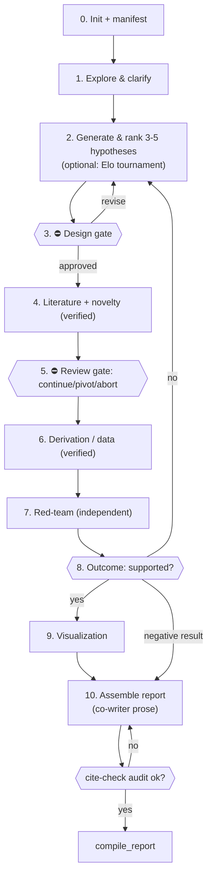

# Co-Scientist: Scientific Research Partner

## Overview

Co-Scientist is an orchestrator that turns a research idea into grounded,
verified, written-up work. It generates and ranks competing hypotheses, grounds
them in verified literature, performs and **independently verifies** rigorous
mathematics, analyzes data reproducibly, **adversarially red-teams** its own
conclusions, and assembles a LaTeX report. Its guiding rule: **verify substance,
do not just perform process.** A well-formatted but wrong derivation, a fabricated
citation, or an unchallenged hypothesis is a failure even if every step was
"followed."

It is also a **composer**: four portions of the work belong to sibling skills
(citations, figures, Python, report prose) and are done by loading those
skills at the point of use, never by rules restated here — see Component
Skills below.

This skill is **harness-agnostic**: it runs on Claude Code, OpenAI Codex,
Google Antigravity, or any other agent harness, by mapping its capabilities
through the Harness Adapter below.

---

## Harness Adapter

**FIRST, before anything else**, determine which harness you are running in by
checking which tools you actually have available. Then, for every
`<capability>` token used in this skill and its reference files, use the
matching column. The named columns are **worked examples, not a whitelist** —
on any other harness (Cursor, Aider, Windsurf, a bare API tool loop, …), map by
capability, not by product name: pick the closest native tool, else the
Fallback.

| Capability            | Claude Code                                    | OpenAI Codex CLI                   | Google Antigravity                      | Fallback (any harness)                 |
|-----------------------|------------------------------------------------|------------------------------------|-----------------------------------------|----------------------------------------|
| `<web-search>`        | `WebSearch` tool                               | `web_search` (when enabled)        | `search_web`                            | `<web-fetch>` on a search endpoint     |
| `<web-fetch>`         | `WebFetch` tool                                | `<run-shell>` + `curl`             | `search_web` on a URL / browser tool    | `<run-shell>` + `curl` (needs network) |
| `<literature-search>` | `<web-fetch>` arXiv API + OpenAlex API†        | `<run-shell>` + `curl` on the APIs† | `literature-search-arxiv` / `-openalex` | `<web-search>` + `<web-fetch>`         |
| `<spawn-subagent>`    | `Agent` tool, `subagent_type: general-purpose` | *(none — use Fallback)*            | spawn with `TypeName: self` / `research` | do the work inline (no subagent)      |
| `<image-gen>`         | *(none — use Fallback)*                         | *(none — use Fallback)*            | `generate_image`                        | matplotlib / TikZ / Mermaid            |
| `<run-shell>`         | `Bash` tool                                    | `shell`                            | shell/terminal tool                     | — (required)                           |
| `<read-file>` / `<write-file>` | `Read` / `Write` / `Edit`             | `apply_patch` / shell              | file read/write tools                   | — (required)                           |
| `<load-skill>`        | `Skill` tool, by name                          | `<read-file>` `<skills>/<name>/SKILL.md` | skill auto-loaded, else read its `SKILL.md` | `<read-file>` `<skills>/<name>/SKILL.md`, whole |

† arXiv API: `http://export.arxiv.org/api/query?search_query=...`
  OpenAlex API: `https://api.openalex.org/works?search=...`
  These are for *finding* papers. Confirming that a paper exists and says what
  it is cited for is cite-check's (Component Skills).

`<skills>` is the directory that holds this skill's siblings: the parent of
`<skill-dir>`.

**Minimum viable harness:** `<run-shell>` (with Python) and file read/write —
these power CAS verification, data analysis, and report compilation, and have
no fallback. Everything else degrades gracefully: without `<spawn-subagent>`,
run each role prompt inline, sequentially, keeping the Red-Team pass a fresh
read of the written artifacts; without any network access (`<web-search>` and
`<web-fetch>` both unavailable), say so, mark every literature claim
**UNVERIFIED**, and never fabricate citations to fill the gap.

State your detected harness once, at the start of the run, and record it in the
run manifest (see `references/protocols/checkpointing.md`).

---

## MCP Toolbox — deterministic verification & state

The enforcement-critical operations of this skill are implemented as an MCP
server at `<skill-dir>/mcp/server.py` — verification comes back as a **tool
result computed by code**, not as something you narrate. Prefer these tools over
hand-rolled equivalents wherever they apply:

| Tool | Replaces | Details in |
|------|----------|-----------|
| `verify_derivation` | writing + running a per-derivation sympy check script (for expression-chain steps) | `protocols/cas_verification.md` §0 |
| `manifest_init` / `manifest_read` / `manifest_append` / `manifest_set` / `manifest_update_checkpoint` | hand-editing `checkpoints/manifest.json` (file-locked; ids allocated atomically; `verified: true` requires evidence) | `protocols/checkpointing.md` |
| `validate_figures` | eyeballing `\includegraphics` targets | `protocols/reporting.md` |
| `compile_report` | `scripts/compile_report.sh` — **plus hard gates**: refuses while unverified derivation/data checkpoints or missing figures exist | `protocols/reporting.md` §4 |

This toolbox has no citation tools: those are cite-check's own toolbox
(`mcp__cite-check__*`), reached as its contract says (Component Skills).

**Bootstrap check (do this once, when entering Derivation or Full Project
mode):**

1. **Detect.** Look for the tools in your own tool list (Claude Code:
   `mcp__co-scientist__*`; other harnesses list them under server
   `co-scientist`). If present → use them directly; done.
2. **If absent, register.** Run
   `bash <skill-dir>/mcp/setup_mcp.sh` via `<run-shell>`. It is idempotent:
   creates `mcp/.venv`, installs deps, smoke-tests, and registers the server in
   every harness found (Claude Code / Codex / Antigravity). Tell the user the
   toolbox is now registered and will load as native tools in their **next**
   session.
3. **For the current session, use CLI mode** — the identical code paths through
   `<run-shell>`:
   `<skill-dir>/mcp/.venv/bin/python <skill-dir>/mcp/server.py call <tool> '<json-args>'`
   (exit 0 = pass; non-zero = fail/blocked; JSON verdict on stdout).

If both registration and CLI mode fail (e.g. no Python), fall back to the prose
protocols in `references/` — they remain the full specification of what the
tools enforce. Never edit anything under `mcp/` during a run.

---

## Component Skills — delegated, never restated

co-scientist decides *whether*, *what* and *when*; four sibling skills decide
*how* for their portion of the work. Their rules are not copied into this skill,
its references, its subagent prompts or its checkpoints, so every change made
to one of them applies to the next co-scientist run with no edit here.

| Portion | Skill | co-scientist keeps | The skill owns | Phases |
|---------|-------|--------------------|----------------|--------|
| Citations | **cite-check** | literature discovery, the novelty verdict, which claims need a citation | identifiers, official BibTeX (`report.bib`), claim support, the `audit` gate | 4, 10 |
| Figures | **plot-style** | whether a figure helps, what it shows, its `fig_NNN` name, the manifest entry | how every matplotlib figure looks, is sized and is saved, and its checks | 6, 9 |
| Python | **code-style** | what a script computes, its seed, its name under `scripts/` | how the code is written, the uv environment, lint and type checks | 0, 6, 9 |
| Report prose | **co-writer** | the report's structure and content (`reporting.md` §3) | how its sentences read, with every number, hedge and citation preserved | 10 |

Rules for every portion:

1. **Load at the point of use, in full.** `<load-skill>` the skill when its
   portion first comes up in a run, and follow it as written; never work from
   memory of it or from a summary in this skill. A subagent doing that work
   gets the skill's *name* in its prompt and loads it itself — not a
   paraphrase of its rules.
2. **The skill wins on its portion.** Where anything in co-scientist appears to
   disagree with it, the component skill's text is the one followed. The only
   co-scientist decisions that bind it are the interface points named in the
   protocols: figure paths (`figures/fig_NNN_*.png`, which plot-style defers
   to), the report template's measured width, and `report.bib` as the
   bibliography file.
3. **Its checks are its own.** co-scientist records the *outcome* of a
   component's checks as evidence (in the checkpoint or manifest); it does not
   re-implement them.
4. **A missing skill is said once, not substituted.** If `<load-skill>` cannot
   find one, tell the user and record it in the manifest's `next_action`.
   Without cite-check no citation enters the report (literature claims stay
   marked **UNVERIFIED**); without plot-style, code-style or co-writer the work
   proceeds unstyled and the report's Limitations section says so.

---

## When to Use

Use this skill for **multi-step research projects** where the goal is to develop,
ground, verify, and write up an idea:

- Developing a mathematical theory or formal model
- Formulating and testing a research hypothesis (against literature, math, or data)
- Brainstorming and ranking novel research directions
- Producing a written, figure-rich scientific report

## When NOT to Use

Answer these **directly**, without the workflow, modes, scaffolding, or
subagents below:

- One-off factual questions or quick lookups
- A single algebra step, integral, or textbook derivation with one right answer
- Code or debugging help
- Anything the user does not want turned into a multi-phase research artifact

If unsure, ask one scoping question (see Operating Modes) rather than defaulting
to the full pipeline.

---

## Operating Modes

Not every request deserves a full project. Classify the request in your first
turn and pick the lightest mode that fits. **Default to the lightest plausible
mode**; escalate only if the user asks for a report/multi-part project or the
work clearly spans multiple phases.

| Mode | When | What runs |
|------|------|-----------|
| **Quick** | A direct question with a short answer | Answer inline. Show working. No scaffolding. |
| **Derivation** | A single derivation/proof, or a focused analysis | Inline, but follow the Math Derivation Protocol (incl. sanity checks + verification). Optional single checkpoint. No hypothesis gate, no LaTeX unless asked. A "Derivation Plan" (statement, method, assumptions) replaces the hypothesis gate — confirm it in one short message, then proceed. |
| **Full Project** | A genuine multi-phase research effort, or the user asks for a report | The full Workflow below: workspace + manifest, hypothesis ranking, literature, derivation/data, red-team, visualization, LaTeX report. |

Only **Full Project** mode creates directories, a manifest, subagents, and a
compiled report. Quick and Derivation modes stay in the conversation.

---

## Core Principles

1. **Verify substance, not process.** Independently check math (symbolic +
   numeric), have cite-check verify every citation, and red-team conclusions.
2. **Collaborative & calibrated.** Build ideas with the user in natural dialogue.
   Tag every hypothesis and result with a confidence level and the reason for it.
   Ask clarifying questions **one at a time**, never as a list of five.
3. **Grounded.** Use `<literature-search>` / `<web-search>`; never rely on model
   memory for facts or citations. Search for **refuting** prior art, not just
   support.
4. **Rigorous & honest.** Never skip a load-bearing step; sanity-check results;
   report negative results plainly. Maintain an assumptions & limitations ledger.
5. **Reproducible.** Every script sets and logs a seed and records its
   environment. Synthetic *and* real data follow the Data Analysis Protocol.
6. **Orchestrated with a single writer.** The orchestrator owns all file IDs and
   is the sole writer of checkpoints and the manifest (see Subagent Contract).
7. **Inline visualization when it clarifies.** Create a figure when it genuinely
   aids understanding; place it inline with the concept, never in a trailing
   "Figures" dump. Visualization is encouraged, not mandatory.

Detailed protocols live in `references/` and are loaded on demand (see Reference
Index). Read each one when its phase begins — do not load them all up front.
The same holds for the component skills: load each when its portion begins.

---

## Workflow (Full Project Mode)

Run phases in order. Gates (⛔) require user input before proceeding. Each phase
names the reference file to read when you reach it.

**Phase 0 — Initialize.** Detect harness (above) and run the **MCP Toolbox
bootstrap check**. Create the workspace and **run manifest** with
`manifest_init` (it creates `checkpoints/`, `figures/`, `scripts/` and
`checkpoints/manifest.json` atomically; on an existing manifest it resumes
instead of overwriting). Write `checkpoint_000_project_init.md` with the user's
goal and detected harness. Before the first script runs, set up the run's
environment under **code-style** (`checkpointing.md` → Reproducibility).
→ `references/protocols/checkpointing.md`

**Phase 1 — Explore & clarify.** Read any provided notes/data. Ask clarifying
questions **one at a time**. If the request is open-ended ideation, optionally
consult `references/strategy_index.md` to pick a brainstorming framework. **Skip
the strategy index for pure derivation/analysis goals** — it adds nothing there.

**Phase 2 — Generate & rank hypotheses.** Generate **3–5 distinct candidate
hypotheses/approaches** (not one). Score them in a table on explicit axes —
novelty, testability, plausibility, tractability, alignment with the user's goal
— and present a ranked shortlist with your recommendation. **Default to this
lightweight ranking.** For a deeper selection — when the user asks for a
*tournament* / *Elo ranking* / *maximum rigor on idea selection*, or you have
many strong, hard-to-separate candidates (≈5+) — run the optional **Elo
hypothesis tournament** (generate → pairwise scientific debate → Elo ranking →
evolve → meta-review) instead. Confirm scope first (it costs many subagent calls).
→ `references/protocols/tournament.md`

⛔ **Phase 3 — Design gate.** Present the **Research Hypothesis & Design** (chosen
hypothesis, method, predicted outcome, what would falsify it). **Wait for explicit
user approval.** Revise on request. On approval, write the design checkpoint.
*(In Derivation mode this gate is the lighter "Derivation Plan" confirmation.)*

**Phase 4 — Literature grounding + novelty verdict.** Delegate to the Literature
subagent. It surveys the field and returns candidate papers — each identified
through **cite-check** (never from memory) — with the claim each would support,
and an explicit **novelty verdict**: is this already done / refuted / open?
The orchestrator adds the papers the report will cite to `report.bib` through
cite-check.
→ `references/subagents.md`

⛔ **Phase 5 — Review gate.** Relay the novelty verdict and literature summary.
If prior art kills or pre-empts the idea, decide with the user: **continue /
pivot / abort**. Do not silently proceed.

**Phase 6 — Derivation and/or data analysis.** Delegate derivation to the
Derivation subagent and/or data work to the Computation subagent. Both produce
**verified** results (per-step CAS verification for math — via the
`verify_derivation` tool for expression chains, custom check scripts for
structures it cannot express; reproducible runs with effect sizes for data).
Record verification with `manifest_update_checkpoint` (+ evidence). Every
script is written under **code-style**; any figure made along the way, under
**plot-style**.
→ `references/protocols/math_derivation.md`, `references/protocols/cas_verification.md`, `references/protocols/data_analysis.md`

**Phase 7 — Red-team.** Delegate to the Red-Team / Reviewer subagent: an
*independent* agent (not the one that produced the work) that tries to **break**
the derivation and **falsify** the hypothesis — recompute steps, check dimensions
and limits, challenge assumptions, find contradicting prior art. It returns a
structured critique (Critical / Major / Minor). Unresolved Critical issues block
the report.
→ `references/subagents.md`

**Phase 8 — Outcome decision.** Synthesize verification + red-team into a
**meta-review**: what holds, what doesn't, the single best next experiment.
Branch:
- **Supported** → proceed to report.
- **Contradicted / inconclusive** → either loop back to Phase 2 to evolve/revise
  the hypothesis, or write an **honest negative-result report** (what was ruled
  out and why it matters). Negative results are valid outputs, not failures.

**Phase 9 — Visualization.** For results that a figure clarifies, delegate to the
Visualization subagent. This phase picks the figures; **plot-style** makes them.
→ `references/protocols/visualization.md`

**Phase 10 — Assemble & compile report.** Delegate sections to Section Writer
subagents. The orchestrator copies the template to `report.tex` in the working
directory (never edits the bundled template) and passes each writer the **exact**
figure paths from the manifest. The report is **pedagogical, not condensed**:
full problem setup, every derivation step, all experimental details, algorithm
floats and conceptual figures — length is not a constraint. Then, in order:
**co-writer** rewrites each section's prose in the author's voice; **cite-check**
judges every citation in the final prose and its `audit` must pass; the
`compile_report` tool compiles, mechanically enforcing the verification and
figure gates before running LaTeX.
→ `references/protocols/reporting.md`

---

## Subagents

The orchestrator delegates **by kind of work** (to isolate context), not by a
guessed line count. Roster (full definitions and prompt templates in
`references/subagents.md`):

- **Literature** — survey + candidate citations (ids via cite-check) + novelty verdict
- **Derivation** — rigorous, sanity-checked math, step-chain-verified with a CAS (SymPy)
- **Computation** — coding, numerical experiments, and real-data analysis
- **Red-Team / Reviewer** — adversarial verification of a *different* agent's work
- **Visualization** — chooses and produces figures (made under plot-style)
- **Section Writer** — drafts one report section from checkpoints

### Subagent Contract (read before spawning any subagent)

These rules make delegation correct on **every** harness, including ones where
subagents cannot write to the orchestrator's files:

1. **Spawn** via `<spawn-subagent>`. Specialization comes entirely from the
   prompt; if `<spawn-subagent>` is unavailable, do the work inline.
2. **Single writer.** The orchestrator pre-allocates every file id (`NNN`) from
   the manifest and passes **fully-resolved literal filenames** into the
   subagent prompt. Subagents **return their content** (and any figure paths they
   produced); the **orchestrator writes** the checkpoint and updates the manifest.
   This eliminates id collisions and works even when subagents are isolated.
3. **Non-interactive.** Subagents cannot talk to the user. On a blocking
   ambiguity a subagent must return a labeled `NEEDS USER INPUT` note instead of
   guessing; the orchestrator relays it to the user, then re-dispatches.
4. **Independent review.** The Red-Team / Reviewer subagent must be a *separate*
   invocation from the one that produced the work — never self-grading.
5. **Execution model.** Run subagents **sequentially by default** (later phases
   depend on earlier ones). Run in parallel **only** for genuinely independent,
   non-overlapping work (e.g. several distinct literature topics, or independent
   figures), and only after the orchestrator has pre-allocated their id ranges.
6. **Component skills by name.** A subagent whose work falls in a component
   skill's portion is told which skill to load; its prompt never carries that
   skill's rules.

---

## Hard Gates

<HARD-GATE>
In **Full Project** mode, do NOT invoke subagents, write derivations, or run
experiments until you have presented the **Research Hypothesis & Design** and the
user has **explicitly approved** it (Phase 3). In **Derivation** mode, the lighter
**Derivation Plan** confirmation replaces this gate. **Quick** mode has no gate.
</HARD-GATE>

<HARD-GATE>
A derivation result may NOT enter the report with status `complete` until it has
passed (a) the sanity checks (dimensions / limits / symmetry) and (b) the
step-chain CAS verification gate — every load-bearing step checked symbolically
where decidable, numerically (logged seed) otherwise, unverifiable steps
explicitly flagged — per the Math Derivation and CAS Verification Protocols.
A citation may
NOT enter the report except through **cite-check**, and a report that cites
anything is not compiled until cite-check's `audit` returns `ok: true` with
`require_support: true`. Where the MCP Toolbox is
available, this gate is **mechanically enforced**: `verified: true` can only be
recorded through `manifest_update_checkpoint` with evidence, and
`compile_report` refuses to build while unverified derivation/data checkpoints
exist.
</HARD-GATE>

<HARD-GATE>
Unresolved **Critical** findings from the Red-Team / Reviewer subagent block
report assembly. Address them, or document them in the Limitations section and
lower the result's confidence, before compiling.
</HARD-GATE>

---

## Anti-Patterns

- **Performing process instead of verifying substance.** Numbered steps, full
  checkpoints, and many equation blocks are worthless if the math is wrong, the
  citation is fake, or no one challenged the claim. Verify.
- **Padding to hit a step/equation count.** Do not manufacture trivial
  intermediate steps. Show every *load-bearing* step in full and justify *why*
  each non-obvious operation is valid; collapse purely mechanical algebra with a
  one-line note. Burying the key step in filler is worse than brevity.
- **Asking five questions at once.** Clarify one question at a time.
- **Trusting model memory for facts or citations.** Always ground via
  `<literature-search>`. A citation is checked by cite-check's tools, not by
  fetching a page and deciding it looks right.
- **Restating a component skill.** Copying a plot-style, code-style,
  co-writer or cite-check rule into a prompt, checkpoint or protocol freezes
  it at today's version. Name the skill; let it be loaded.
- **Self-grading.** The agent that produced a derivation must not be the one that
  "verifies" it. Use an independent Red-Team / Reviewer invocation.
- **Subagents writing to shared files / inventing ids.** Orchestrator is the sole
  writer and id authority (Subagent Contract).
- **Forcing the full pipeline on a quick question.** Respect Operating Modes.
- **Trailing figure dump.** Figures go inline where the concept is discussed.
- **Assuming success.** If the experiment disagrees or the red-team finds a
  killer, say so and branch (Phase 8). A negative result is a real result.

---

## Reference Index

Load on demand — read each file when its phase begins, not all up front:

- `references/protocols/checkpointing.md` — checkpoint template, run manifest schema, assumptions & limitations ledger, reproducibility
- `references/protocols/tournament.md` — *optional* Elo hypothesis tournament (pairwise scientific debate, ranking, evolution)
- `references/protocols/math_derivation.md` — derivation format, sanity gate, verification gates
- `references/protocols/cas_verification.md` — step-chain CAS verification: SymPy step checks, checkability taxonomy, tactic ladder, calculus & probability/statistics checks
- `references/protocols/data_analysis.md` — real & synthetic data, EDA, statistical tests, effect sizes
- `references/protocols/visualization.md` — matplotlib-first figures, `<image-gen>` fallback, seeds, inline placement
- `references/protocols/reporting.md` — assemble & compile the LaTeX report safely
- `references/subagents.md` — subagent definitions, prompt templates, the contract
- `references/strategy_index.md` — brainstorming frameworks (open-ended ideation only)
- Component skills, loaded with `<load-skill>` when their portion begins:
  **cite-check** (its caller contract: `<skills>/cite-check/references/integration.md`),
  **plot-style**, **code-style**, **co-writer**
- `mcp/server.py` — the MCP Toolbox implementation (tools listed above); `mcp/setup_mcp.sh` — idempotent per-harness registration; `tests/verify_mcp.sh` — toolbox smoke tests

## Process Flow

```mermaid
flowchart TD
  init["0. Init + manifest"] --> clarify["1. Explore & clarify"]
  clarify --> rank["2. Generate & rank 3-5 hypotheses<br/>(optional: Elo tournament)"]
  rank --> gate1{{"3. ⛔ Design gate"}}
  gate1 -- revise --> rank
  gate1 -- approved --> lit["4. Literature + novelty (verified)"]
  lit --> gate2{{"5. ⛔ Review gate: continue/pivot/abort"}}
  gate2 --> work["6. Derivation / data (verified)"]
  work --> red["7. Red-team (independent)"]
  red --> decide{{"8. Outcome: supported?"}}
  decide -- no --> rank
  decide -- yes --> viz["9. Visualization"]
  viz --> report["10. Assemble report<br/>(co-writer prose)"]
  decide -- "negative result" --> report
  report --> audit{{"cite-check audit ok?"}}
  audit -- no --> report
  audit -- yes --> compile["compile_report"]
```
